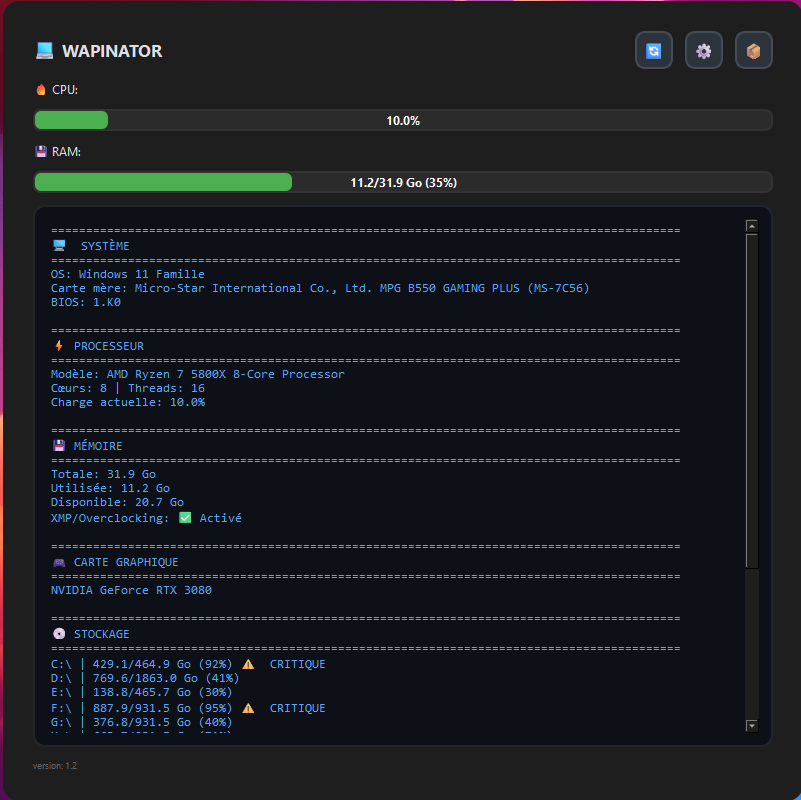
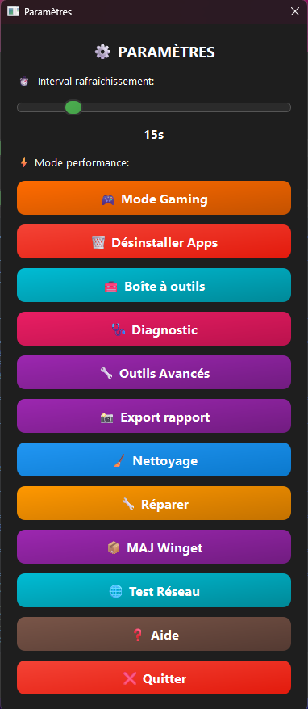

# 🔧 Wapinator - L'Outil PC Ultime pour Windows

[](https://opensource.org/licenses/MIT)
[](https://www.python.org/downloads/)
[](https://www.microsoft.com/windows)

**Wapinator** est un outil tout-en-un de monitoring et maintenance PC pour Windows 10/11. Interface moderne, 10+ modules avancés, optimisations gaming, tutoriels inclus !

---

## 📸 Aperçu

### Interface Principale


### Hub Outils Avancés


### Paramètres


---

## ✨ Fonctionnalités

### 📊 Monitoring Temps Réel
- CPU, RAM, GPU avec barres colorées
- Carte mère, BIOS, version Windows
- Top 5 processus gourmands
- Ping réseau instantané
- Refresh auto personnalisable (5-60s)

### 🧹 Maintenance Automatique
- **Nettoyage Windows** : Temp, cache DNS, corbeille, WU
- **Réparation Système** : SFC + DISM automatique
- **Mise à jour Winget** : MAJ toutes les apps en 1 clic
- **Test Réseau** : Ping multi-serveurs + diagnostics

### 🎮 Optimiseur Gaming (4 Profils)
- ⭐ **Léger** : Souris + Hautes Perfs + Game Bar off
- ⭐⭐ **Complet** : Léger + Visuels off + Transparence off
- ⭐⭐⭐ **Compétitif** : Complet + Ultimate Performance
- 🔄 **100% réversible** en 1 clic

### 🗑️ Gestionnaire de Programmes
- Liste TOUS les programmes (Registry)
- Désinstallation multiple
- Détection bloatware auto
- Protection programmes système

---

## 🔧 10 Modules Avancés

| Module | Description |
|--------|-------------|
| 📘 **Analyseur BSOD** | Décode .dmp + solutions par type de crash |
| 🔋 **Santé Batterie** | Rapport PowerCfg complet (usure, cycles) |
| 🌐 **Test Réseau** | Ping, DNS, packet loss, diagnostics |
| 💾 **Gestionnaire Drivers** | MAJ + Backup + Rollback drivers |
| 🚀 **Nettoyeur Démarrage** | Optimisation boot + score impact |
| 💊 **Santé Windows** | Check intégrité + score /100 |
| 🌡️ **Moniteur Températures** | CPU/GPU/Disques temps réel + alertes |
| 🔄 **Réparateur Windows Update** | Fix erreurs WU + reset services |
| 🧪 **Testeur RAM** | Diagnostic mémoire + Memory Diagnostic |
| 🗑️ **Nettoyeur Bloatware** | Détection + suppression auto |

---

## 🧰 Boîte à Outils (15+ logiciels)

**Tutoriels complets pas-à-pas inclus :**

### 🔧 Réparation & Diagnostic
- MemTest86+, CrystalDiskInfo, HWiNFO64
- Snappy Driver Installer, DDU, Victoria
- Malwarebytes

### 🎮 Gaming & Performances
- MSI Afterburner, GeForce Experience
- Process Lasso, ISLC, LatencyMon

### 🌐 Réseau
- Wireshark, TCP Optimizer

### 📊 Benchmark
- Cinebench R23, 3DMark

---

## 🩺 Diagnostic par Symptômes

Cochez vos problèmes → Plan d'action priorisé avec probabilités

- 🐌 PC lent au démarrage
- ❄️ Freezes/blocages
- 💙 BSOD fréquents
- 🎮 FPS bas/drops
- ⚡ Stuttering
- 🔥 Surchauffe
- 🌐 Problèmes réseau
- Et 15+ autres symptômes...

---

## 🚀 Installation

### Option 1 : EXE Standalone (Recommandé)

1. **Télécharger** depuis [Releases](https://github.com/BerurierNoir/WAPINATOR-/releases)
2. **Clic droit** > Exécuter en tant qu'administrateur
3. **C'est tout !** Aucune installation requise

### Option 2 : Python
```bash
git clone https://github.com/BerurierNoir/WAPINATOR-.git
cd WAPINATOR-
pip install -r requirements.txt
python Wapinator.py
```

---

## 📋 Prérequis

- **OS** : Windows 10/11 (64-bit)
- **Python** : 3.8+ (si version source)
- **Admin** : Droits administrateur recommandés

---

## 💡 Pourquoi Wapinator ?

✅ **Tout-en-un** : Remplace 20+ outils séparés  
✅ **Gratuit** : 100% gratuit, aucune pub  
✅ **Sûr** : Open source, zéro télémétrie  
✅ **Moderne** : Interface dark GitHub-style  
✅ **Tutoriels** : Guides complets inclus  
✅ **Léger** : ~50-80 Mo RAM  
✅ **Français** : Interface 100% FR  

---

## 🤝 Contribution

Les contributions sont les bienvenues !

1. Fork le projet
2. Créez votre branche (`git checkout -b feature/AmazingFeature`)
3. Commit (`git commit -m 'Add AmazingFeature'`)
4. Push (`git push origin feature/AmazingFeature`)
5. Ouvrez une Pull Request

---

## 🐛 Bugs & Suggestions

📌 [Issues GitHub](https://github.com/BerurierNoir/WAPINATOR-/issues)

---

## 📜 Licence

MIT License - voir [LICENSE](LICENSE)

---

## 🙏 Crédits

Développé par **Wap** ([BerurierNoir](https://github.com/BerurierNoir))

**Remerciements :**
- Claude AI (assistance développement)
- Communauté Discord
- Tous les contributeurs

---

## ⭐ Soutenez le projet

Si Wapinator vous est utile :
- ⭐ **Star le repo**
- 🐛 **Signalez les bugs**
- 💬 **Partagez sur Discord**
- 💡 **Proposez des idées**

---

**Made with ❤️ for the PC community**

📥 [Download](https://github.com/BerurierNoir/WAPINATOR-/releases) • 🌟 [GitHub](https://github.com/BerurierNoir/WAPINATOR-) • 💬 [Discord](votre-lien)